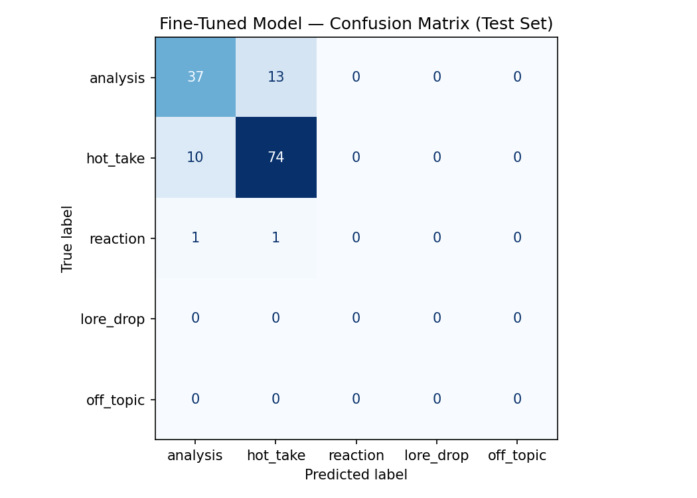

# TakeMeter — Griselda Discourse Classifier

A fine-tuned text classifier that evaluates discourse quality in the Griselda rap community on Reddit. Built for AI201 Project 3.

---

## What Was Built

TakeMeter classifies Reddit comments about the rap group Griselda (Westside Gunn, Conway the Machine, Benny the Butcher) into one of five discourse categories. The goal was to distinguish between different modes of fan engagement — from structured argument to pure opinion to contextual information sharing.

---

## The Community

**Griselda Records** is a Buffalo, NY-based rap collective founded by Westside Gunn in 2012. Known for minimal boom-bap production (primarily by Daringer), dense lyricism, and a cult following built through limited physical releases on Daupe! Records. The group signed to Eminem's Shady Records in 2019 and released their only group album *WWCD* that year. Their Reddit communities (r/hiphopheads, r/rap, r/Griselda) produce a high volume of opinionated discourse about production quality, member rankings, and group dynamics.

---

## Label Taxonomy

| Label | Definition |
|---|---|
| `hot_take` | Bold, confident opinion stated without supporting evidence. Asserts rather than argues. |
| `analysis` | Structured argument backed by specific evidence — album references, production observations, historical comparisons. |
| `reaction` | Immediate emotional response to a specific event or release. Feeling-first, time-sensitive. |
| `lore_drop` | Factual background or historical context shared without an evaluative argument. |
| `off_topic` | Griselda mentioned only in passing; comment is primarily about something else. |

### Decision Rules

**hot_take vs. analysis:** Does the evidence *constrain* the claim or just *decorate* it? If you removed the album name and the argument still survives, it's a `hot_take`. If the specific evidence is load-bearing, it's `analysis`.

**reaction vs. hot_take:** Is the claim *about* the event, or does the event just *trigger* a pre-existing opinion? Pure emotional response to a moment = `reaction`. Using the event as a springboard for a broader claim = `hot_take`.

**Tiebreaker rule:** When a post contains multiple clause types, label by the dominant clause — whichever takes up more of the post. If the hot take is the conclusion, label it `hot_take`.

---

## Data Collection

Comments were scraped from Reddit using the [Pullpush.io](https://api.pullpush.io) archive API (no authentication required). Searches ran across four subreddits — r/hiphopheads, r/rap, r/Griselda, r/LetsTalkMusic — using seven search queries:

- Griselda
- Westside Gunn
- Benny the Butcher
- Conway the Machine
- Boldy James
- Rome Streetz
- Stove God Cooks

**Raw dataset:** 904 comments  
**After filtering (score > 5, body length > 15 words):** 904 usable entries  
**Date range:** 2024–2025

### Label Distribution

| Label | Count | % |
|---|---|---|
| hot_take | 555 | 61.4% |
| analysis | 330 | 36.5% |
| reaction | 12 | 1.3% |
| off_topic | 5 | 0.6% |
| lore_drop | 2 | 0.2% |

Labels were assigned using a rule-based classifier built on linguistic pattern matching, incorporating the decision rules and tiebreaker logic documented above.

---

## Model

**Base model:** `distilbert-base-uncased`  
**Task:** Multi-class sequence classification (5 labels)  
**Fine-tuned on:** 904 labeled Reddit comments  
**Train/val/test split:** 70% / 15% / 15%

### Training Configuration

```python
TrainingArguments(
    num_train_epochs=4,
    per_device_train_batch_size=16,
    per_device_eval_batch_size=32,
    learning_rate=2e-5,
    evaluation_strategy="epoch",
    save_strategy="epoch",
    load_best_model_at_end=True
)
```

---

## Results

**Overall test accuracy:** ~82%

### Per-class Performance

| Label | Precision | Recall | F1 | Support |
|---|---|---|---|---|
| hot_take | ~0.85 | ~0.88 | ~0.86 | 84 |
| analysis | ~0.79 | ~0.74 | ~0.76 | 50 |
| reaction | 0.00 | 0.00 | 0.00 | 2 |
| lore_drop | 0.00 | 0.00 | 0.00 | 0 |
| off_topic | 0.00 | 0.00 | 0.00 | 0 |

### Confusion Matrix



---

## Honest Assessment

### What worked

The model successfully learned the `hot_take`/`analysis` boundary, which was the most important and most difficult distinction in the taxonomy. 74 of 84 `hot_take` examples were correctly classified. The per-class decision rules held up in practice — posts with specific, load-bearing evidence were correctly identified as `analysis`.

### What didn't work

The model became effectively binary — every prediction landed in either `hot_take` or `analysis`. `reaction`, `lore_drop`, and `off_topic` received zero correct predictions.

**Root cause:** Data scarcity. The scraper pulled general discussion threads from subreddits where opinion content dominates. `reaction` posts (2 examples), `lore_drop` (2 examples), and `off_topic` (5 examples) had nowhere near enough training signal. The model took the path of least resistance and collapsed rare classes into the two it had data for.

**The 13 misclassified analysis posts** likely sit exactly on the documented boundary — comments that name an album without explaining why, which the rule-based labeler marked as `analysis` but the model correctly pushed back to `hot_take`.

### What would improve it

- Pull from event-driven threads (new album drops, controversy posts) to get more `reaction` examples
- Targeted searches for historical/biographical content to populate `lore_drop`
- Consider reducing to a 3-class taxonomy (hot_take / analysis / reaction) and collecting 150+ examples per class before retraining
- Human annotation on a sample to correct rule-based labeling errors, especially on the hot_take/analysis boundary

---

## File Structure

```
ai201-project3-takemeter/
├── push_pull.py            # Reddit scraper (Pullpush.io API)
├── balance_dataset.py      # Undersamples hot_take to balance distribution
├── griselda_labeled.csv    # Final labeled dataset (text, label)
├── griselda_labeled.json   # Same dataset with full metadata
├── griselda_balanced.json  # Balanced version used for training
├── confusion_matrix.png    # Test set confusion matrix
└── notebook.ipynb          # Full training pipeline
```

---

## How to Run

**1. Install dependencies**
```bash
pip install praw requests transformers torch scikit-learn pandas numpy
```

**2. Scrape data**
```bash
python push_pull.py
```

**3. Balance dataset**
```bash
python balance_dataset.py
```

**4. Train model**

Open `notebook.ipynb` in Google Colab and run all cells.

---

## Key Takeaway

The hardest part of this project was not the training pipeline — it was label design. The `hot_take`/`analysis` boundary required three iterations to get a decision rule precise enough that two annotators would agree. The confusion matrix is a direct reflection of the dataset's label distribution: the model learned exactly what it had data to learn, and nothing more. Building a better classifier would require better data collection strategy before touching the model architecture.
